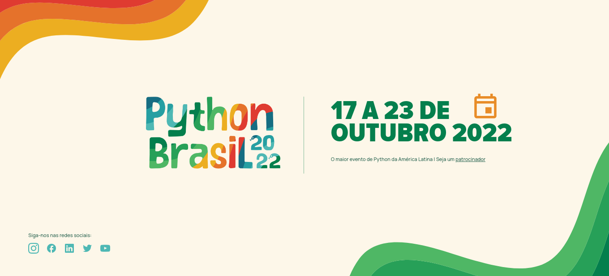

# Python Brasil 2022



<br>

## Ambiente de desenvolvimento

```
$ git clone https://github.com/pythonbrasil/pybr2022-site
$ cd pybr2022-site

```

Para executar o projeto, abra o arquivo index.html no seu navegador.